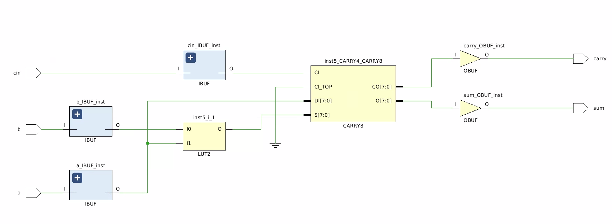
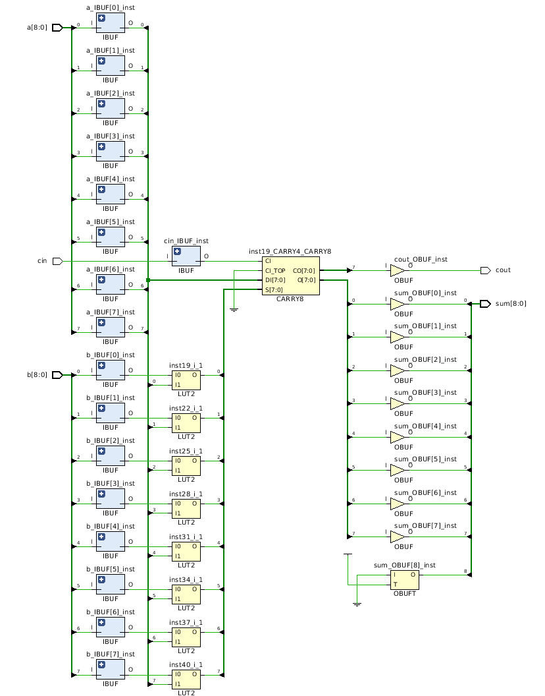

# Cava Examples

This directory describes a few example circuits produced using
the  [Cava](https://github.com/project-oak/oak-hardware/tree/master/cava) system which needs
to be installed before the circuits and proofs can be generated in this directory.

To build the examples in this directory just run `make`:

```bash
$ make
```

# A NAND gate
A simple NAND gate build out of an AND gate and an inverter, along
with a proof about correct operation.

```coq
Definition nand2 {m t} `{Cava m t} := and_gate >=> not_gate.

Definition nand2Top {m t} `{CavaTop m t} :=
  setModuleName "nand2" ;;
  a <- inputBit "a" ;
  b <- inputBit "b" ;
  c <- nand2 [a; b] ;
  outputBit "c" c.

Definition nand2Netlist := makeNetlist nand2Top.

(* A proof that the NAND gate implementation is correct. *)
Lemma nand2_behaviour : forall (a : bool) (b : bool),
                        combinational (nand2 [a; b]) = negb (a && b).
Proof.
  auto.
Qed.
```

This generates the following SysteVerilog code:

```verilog
module nand2(
  input logic b,
  input logic a,
  output logic c
  );

  logic[0:3] net;

  // Wire up inputs.
  assign net[1] = b;
  assign net[0] = a;
  // Wire up outputs.
  assign c = net[3] ;

  not inst3 (net[3],net[2]);
  and inst2 (net[2],net[0],net[1]);

endmodule
```

The Makefile compiles the generated SystemVerilog and runs it with
a checked in testnench [nand2_tb.vs](https://github.com/project-oak/oak-hardware/blob/master/cava-examples/nand2_tb.sv)
which produces a VCD waveform file which can be viewed with a VCD viewer like
[gtkwave](http://gtkwave.sourceforge.net/):


# A half adder
A straight-forward implementation of a half adder using only SystemVerilog
primitive gates, along with a proof about correct operation:

```coq
Definition halfAdder {m t} `{Cava m t} a b :=
  partial_sum <- xor_gate [a; b] ;
  carry <- and_gate [a; b] ;
  return_ (partial_sum, carry).

Definition halfAdderTop {m t} `{CavaTop m t} :=
  setModuleName "halfadder" ;;
  a <- inputBit "a" ;
  b <- inputBit "b" ;
  ps_c <- halfAdder a b ;
  outputBit "partial_sum" (fst ps_c) ;;
  outputBit "carry" (snd ps_c).

Definition halfAdderNetlist := makeNetlist halfAdderTop.

(* A proof that the the half-adder is correct. *)
Lemma halfAdder_behaviour : forall (a : bool) (b : bool),
                            combinational (halfAdder a b) = (xorb a b, a && b).

Proof.
  intros.
  unfold combinational.
  unfold fst.
  simpl.
  case a, b.
  all : reflexivity.
Qed.
```

# Full Adder
A straight-forward full adder made usign the half adder shown above, along
with a proof about correct operation:

```coq
Definition fullAdder {m t} `{Cava m t} a b cin :=
  abl_abh <- halfAdder a b ;
  abcl_abch <- halfAdder (fst abl_abh) cin ;
  cout <- or_gate [snd abl_abh; snd abcl_abch] ;
  return_ (fst abcl_abch, cout).

Definition fullAdderTop {m t} `{CavaTop m t} :=
  setModuleName "fulladder" ;;
  a <- inputBit "a" ;
  b <- inputBit "b" ;
  cin <- inputBit "cin" ;
  sum_cout <- fullAdder a b cin ;
  outputBit "sum" (fst sum_cout) ;;
  outputBit "carry" (snd sum_cout).


Definition fullAdderNetlist := makeNetlist fullAdderTop.

(* A proof that the the full-adder is correct. *)
Lemma fullAdder_behaviour : forall (a : bool) (b : bool) (cin : bool),
                            combinational (fullAdder a b cin)
                              = (xorb cin (xorb a b),
                                 (a && b) || (b && cin) || (a && cin)).
Proof.
  intros.
  unfold combinational.
  unfold fst.
  simpl.
  case a, b, cin.
  all : reflexivity.
Qed.
```

This generates the following SystemVerilog code:

```verilog
module fulladder(
  input logic cin,
  input logic b,
  input logic a,
  output logic carry,
  output logic sum
  );

  logic[0:7] net;

  // Wire up inputs.
  assign net[2] = cin;
  assign net[1] = b;
  assign net[0] = a;
  // Wire up outputs.
  assign carry = net[7] ;
  assign sum = net[5] ;

  or inst7 (net[7],net[4],net[6]);
  and inst6 (net[6],net[3],net[2]);
  xor inst5 (net[5],net[3],net[2]);
  and inst4 (net[4],net[0],net[1]);
  xor inst3 (net[3],net[0],net[1]);

endmodule
```

However, the Xilinx Vivado FPGA implementation tools will fail to map
this onto the fast carry components (CARRRY8, XORCY, MUXCY) to achieve
a fast implementation. This design is mapped to two LUTs which is 
sub-optimal.

## A Fast-carry based full adder
This is another version of a full adder which explicitly uses the
XORCY and MUXCY components to ensure a mapping to the fast carry chain:

```coq
Definition fullAdderFC {m t} `{Cava m t} a b cin :=
  part_sum <- xor_gate [a; b] ;
  sum <- xorcy cin part_sum ;
  cout <- muxcy cin a part_sum ;
  return_ (sum, cout).

Definition fullAdderFCTop {m t} `{CavaTop m t} :=
  setModuleName "fulladderFC" ;;
  a <- inputBit "a" ;
  b <- inputBit "b" ;
  cin <- inputBit "cin" ;
  sum_cout <- fullAdderFC a b cin ;
  outputBit "sum" (fst sum_cout) ;;
  outputBit "carry" (snd sum_cout).


Definition fullAdderFCNetlist := makeNetlist fullAdderFCTop.

(* A proof that the the full-adder is correct. *)
Lemma fullAdderFC_behaviour : forall (a : bool) (b : bool) (cin : bool),
                              combinational (fullAdderFC a b cin)
                               = (xorb cin (xorb a b),
                                   (a && b) || (b && cin) || (a && cin)).
Proof.
  intros.
  unfold combinational.
  unfold fst.
  simpl.
  case a, b, cin.
  all : reflexivity.
Qed.
```

This generates the following SystemVerilog code:

```verilog
  input logic cin,
  input logic b,
  input logic a,
  output logic carry,
  output logic sum
  );

  logic[0:5] net;

  // Wire up inputs.
  assign net[2] = cin;
  assign net[1] = b;
  assign net[0] = a;
  // Wire up outputs.
  assign carry = net[5] ;
  assign sum = net[4] ;

  muxcy inst5 (net[5],net[2],net[0],net[3]);
  xorcy inst4 (net[4],net[2],net[3]);
  xor inst3 (net[3],net[0],net[1]);

endmodule
```

Which does map efficiently onto the fast-carry chain:



# An 8-bit adder mapped to the fast carry chain

This is a Cava description of a generic n-bit unsigned adder.
The `unsignedAdder` definition is a generic n-bit adder where the
size of the adder is determined by the length of the input vectors
provided. The definition makes use of the `col` Lava style circuit
combinator for composing replicated blocks in a chain.

```coq
Definition unsignedAdder {m bit} `{Cava m bit} := col fullAdderFC.
```

We can create a module definition for an 8-bit adder by instantiating
the `unsignedAdder` with 8-bit input vectors.

```coq
Definition adder8Top {m t} `{CavaTop m t} :=
  setModuleName "adder8" ;;
  a <- inputVectorTo0 8 "a" ;
  b <- inputVectorTo0 8 "b" ;
  cin <- inputBit "cin" ;
  sum_cout <- unsignedAdder cin (combine a b) ;
  let sum := fst sum_cout in
  let cout := snd sum_cout in
  outputVectorTo0 sum "sum" ;;
  outputBit "cout" cout.

Definition adder8Netlist := makeNetlist adder8Top.

```

The generated SystemVerilog for the 8-bit adder is:

```verilog
module adder8(
  input logic cin,
  input logic[8:0] b,
  input logic[8:0] a,
  output logic cout,
  output logic[8:0] sum
  );

  logic[0:40] net;

  // Wire up inputs.
  assign net[16] = cin;
  assign net[8] = b[0];
  assign net[9] = b[1];
  assign net[10] = b[2];
  assign net[11] = b[3];
  assign net[12] = b[4];
  assign net[13] = b[5];
  assign net[14] = b[6];
  assign net[15] = b[7];
  assign net[0] = a[0];
  assign net[1] = a[1];
  assign net[2] = a[2];
  assign net[3] = a[3];
  assign net[4] = a[4];
  assign net[5] = a[5];
  assign net[6] = a[6];
  assign net[7] = a[7];
  // Wire up outputs.
  assign cout = net[40] ;
  assign sum[0] = net[18];
  assign sum[1] = net[21];
  assign sum[2] = net[24];
  assign sum[3] = net[27];
  assign sum[4] = net[30];
  assign sum[5] = net[33];
  assign sum[6] = net[36];
  assign sum[7] = net[39];

  MUXCY inst40 (net[40],net[37],net[7],net[38]);
  XORCY inst39 (net[39],net[37],net[38]);
  xor inst38 (net[38],net[7],net[15]);
  MUXCY inst37 (net[37],net[34],net[6],net[35]);
  XORCY inst36 (net[36],net[34],net[35]);
  xor inst35 (net[35],net[6],net[14]);
  MUXCY inst34 (net[34],net[31],net[5],net[32]);
  XORCY inst33 (net[33],net[31],net[32]);
  xor inst32 (net[32],net[5],net[13]);
  MUXCY inst31 (net[31],net[28],net[4],net[29]);
  XORCY inst30 (net[30],net[28],net[29]);
  xor inst29 (net[29],net[4],net[12]);
  MUXCY inst28 (net[28],net[25],net[3],net[26]);
  XORCY inst27 (net[27],net[25],net[26]);
  xor inst26 (net[26],net[3],net[11]);
  MUXCY inst25 (net[25],net[22],net[2],net[23]);
  XORCY inst24 (net[24],net[22],net[23]);
  xor inst23 (net[23],net[2],net[10]);
  MUXCY inst22 (net[22],net[19],net[1],net[20]);
  XORCY inst21 (net[21],net[19],net[20]);
  xor inst20 (net[20],net[1],net[9]);
  MUXCY inst19 (net[19],net[16],net[0],net[17]);
  XORCY inst18 (net[18],net[16],net[17]);
  xor inst17 (net[17],net[0],net[8]);

endmodule
```

After implementing this design using the Xilinx Vivado FPGA design
tools we can view a schematic that confirms this design is mapped to
the fast carry chain.



The 8-bit adder is mapped to once slice of a Zyna UltraScale+ XCZU7EV FPGA using 8 LUTs (for the
XOR partial sums) and all of an 8-bit fast-carry block.


The location of the adder is shown here in the top right hand corner
of the FPGA i.e. the small blue dot in section X3Y5, with the IOs for
the adder mapped to the purple column just to the left of the adder.

