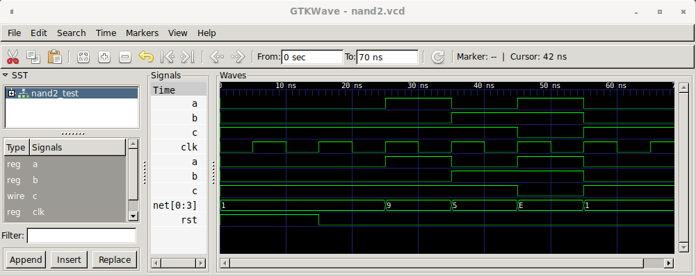
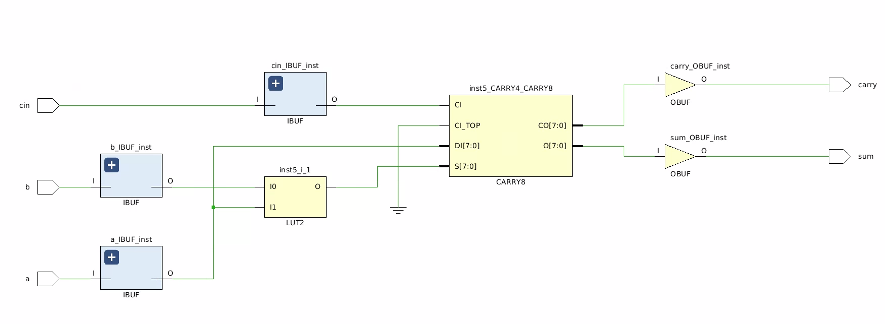
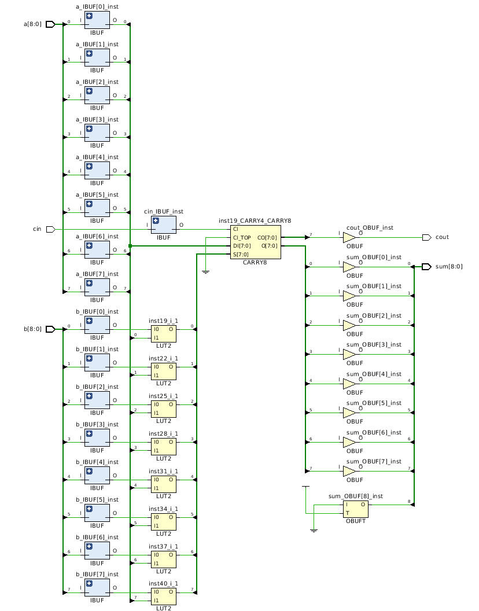
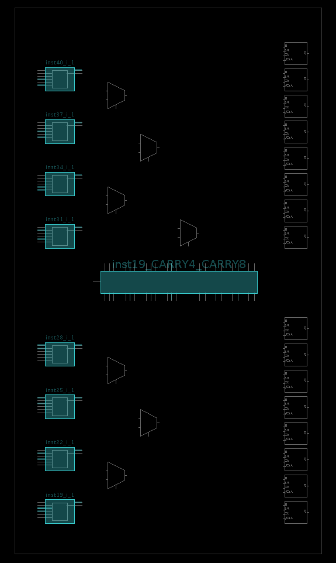
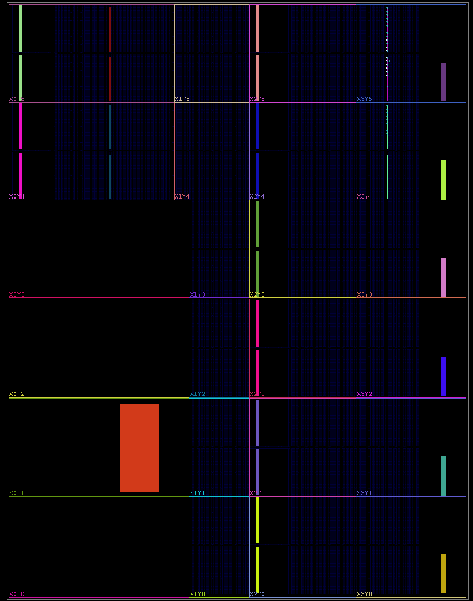

# Cava Examples

This directory describes a few example circuits produced using
the  [Cava](https://github.com/project-oak/oak-hardware/tree/master/cava) system which needs
to be installed before the circuits and proofs can be generated in this directory.

To build the examples in this directory just run `make`:

```bash
$ make
```

# A NAND gate
A simple NAND gate build out of an AND gate and an inverter, along
with a proof about correct operation.

```coq
Definition nand2 {m t} `{Cava m t} := and_gate >=> not_gate.

Definition nand2Top {m t} `{CavaTop m t} :=
  setModuleName "nand2" ;;
  a <- inputBit "a" ;;
  b <- inputBit "b" ;;
  c <- nand2 [a; b] ;;
  outputBit "c" c.

Definition nand2Netlist := makeNetlist nand2Top.

(* A proof that the NAND gate implementation is correct. *)
Lemma nand2_behaviour : forall (a : bool) (b : bool),
                        combinational (nand2 [a; b]) = negb (a && b).
Proof.
  auto.
Qed.
```

This generates the following SysteVerilog code:

```verilog
module nand2(
module nand2(
  input logic b,
  input logic a,
  output logic c
  );

  timeunit 1ns; timeprecision 1ns;

  logic[5:0] net;

  // Constant nets
  assign net[0] = 1'b0;
  assign net[1] = 1'b1;
  // Wire up inputs.
  assign net[3] = b;
  assign net[2] = a;
  // Wire up outputs.
  assign c = net[5] ;

  not inst5 (net[5],net[4]);
  and inst4 (net[4],net[2],net[3]);

endmodule
```

The Makefile compiles the generated SystemVerilog and runs it with
a checked in testnench [nand2_tb.vs](https://github.com/project-oak/oak-hardware/blob/master/cava-examples/nand2_tb.sv)
which produces a VCD waveform file which can be viewed with a VCD viewer like
[gtkwave](http://gtkwave.sourceforge.net/):



# A half adder
A straight-forward implementation of a half adder using only SystemVerilog
primitive gates, along with a proof about correct operation:

```coq
Definition halfAdder {m t} `{Cava m t} a b :=
  partial_sum <- xor_gate [a; b] ;;
  carry <- and_gate [a; b] ;;
  ret (partial_sum, carry).

Definition halfAdderTop {m t} `{CavaTop m t} :=
  setModuleName "halfadder" ;;
  a <- inputBit "a" ;;
  b <- inputBit "b" ;;
  '(ps, c) <- halfAdder a b ;;
  outputBit "partial_sum" ps ;;
  outputBit "carry" c.

Definition halfAdderNetlist := makeNetlist halfAdderTop.

(* A proof that the half-adder is correct. *)
Lemma halfAdder_behaviour : forall (a : bool) (b : bool),
                            combinational (halfAdder a b) = (xorb a b, a && b).

Proof.
  intros.
  unfold combinational.
  unfold fst.
  simpl.
  case a, b.
  all : reflexivity.
Qed.
```

# Full Adder
A straight-forward full adder made usign the half adder shown above, along
with a proof about correct operation:

```coq
Definition fullAdder {m t} `{Cava m t} a b cin :=
  '(abl, abh) <- halfAdder a b ;;
  '(abcl, abch) <- halfAdder abl cin ;;
  cout <- or_gate [abh; abch] ;;
  ret (abcl, cout).

Definition fullAdderTop {m t} `{CavaTop m t} :=
  setModuleName "fulladder" ;;
  a <- inputBit "a" ;;
  b <- inputBit "b" ;;
  cin <- inputBit "cin" ;;
  '(sum, cout) <- fullAdder a b cin ;;
  outputBit "sum" sum ;;
  outputBit "carry" cout.

Definition fullAdderNetlist := makeNetlist fullAdderTop.

(* A proof that the the full-adder is correct. *)
Lemma fullAdder_behaviour : forall (a : bool) (b : bool) (cin : bool),
                            combinational (fullAdder a b cin)
                              = (xorb cin (xorb a b),
                                 (a && b) || (b && cin) || (a && cin)).
Proof.
  intros.
  unfold combinational.
  unfold fst.
  simpl.
  case a, b, cin.
  all : reflexivity.
Qed.
```

This generates the following SystemVerilog code:

```verilog
module fulladder(
  input logic cin,
  input logic b,
  input logic a,
  output logic carry,
  output logic sum
  );

  timeunit 1ns; timeprecision 1ns;

  logic[9:0] net;

  // Constant nets
  assign net[0] = 1'b0;
  assign net[1] = 1'b1;
  // Wire up inputs.
  assign net[4] = cin;
  assign net[3] = b;
  assign net[2] = a;
  // Wire up outputs.
  assign carry = net[9] ;
  assign sum = net[7] ;

  or inst9 (net[9],net[6],net[8]);
  and inst8 (net[8],net[5],net[4]);
  xor inst7 (net[7],net[5],net[4]);
  and inst6 (net[6],net[2],net[3]);
  xor inst5 (net[5],net[2],net[3]);

endmodule

```

However, the Xilinx Vivado FPGA implementation tools will fail to map
this onto the fast carry components (CARRRY8, XORCY, MUXCY) to achieve
a fast implementation. This design is mapped to two LUTs which is 
sub-optimal.

## A Fast-carry based full adder
This is another version of a full adder which explicitly uses the
XORCY and MUXCY components to ensure a mapping to the fast carry chain:

Definition fullAdderFC {m bit} `{Cava m bit} (cin_ab : bit * (bit * bit))
  : m (bit * bit)%type :=
  let cin := fst cin_ab in
  let ab := snd cin_ab in
  let a := fst ab in
  let b := snd ab in
  part_sum <- xor_gate [a; b] ;;
  sum <- xorcy part_sum cin ;;
  cout <- muxcy part_sum a cin  ;;
  ret (sum, cout).

Definition fullAdderFCTop {m t} `{CavaTop m t} :=
  setModuleName "fulladderFC" ;;
  a <- inputBit "a" ;;
  b <- inputBit "b" ;;
  cin <- inputBit "cin" ;;
  '(sum, cout) <- fullAdderFC (cin, (a, b)) ;;
  outputBit "sum" sum ;;
  outputBit "carry" cout.

Definition fullAdderFCNetlist := makeNetlist fullAdderFCTop.

(* A proof that the the full-adder is correct. *)
Lemma fullAdderFC_behaviour : forall (a : bool) (b : bool) (cin : bool),
                              combinational (fullAdderFC (cin, (a, b)))
                               = (xorb cin (xorb a b),
                                   (a && b) || (b && cin) || (a && cin)).
Proof.
  intros.
  unfold combinational.
  unfold fst.
  simpl.
  case a, b, cin.
  all : reflexivity.
Qed.
```

This generates the following SystemVerilog code:

```verilog
module fulladderFC(
  input logic cin,
  input logic b,
  input logic a,
  output logic carry,
  output logic sum
  );

  timeunit 1ns; timeprecision 1ns;

  logic[7:0] net;

  // Constant nets
  assign net[0] = 1'b0;
  assign net[1] = 1'b1;
  // Wire up inputs.
  assign net[4] = cin;
  assign net[3] = b;
  assign net[2] = a;
  // Wire up outputs.
  assign carry = net[7] ;
  assign sum = net[6] ;

  MUXCY inst7 (net[7],net[4],net[2],net[5]);
  XORCY inst6 (net[6],net[4],net[5]);
  xor inst5 (net[5],net[2],net[3]);

endmodule
```

Which does map efficiently onto the fast-carry chain:



# An 8-bit adder mapped to the fast carry chain

This is a Cava description of a generic n-bit unsigned adder.
The `unsignedAdder` definition is a generic n-bit adder where the
size of the adder is determined by the length of the input vectors
provided. The definition makes use of the `col` Lava style circuit
combinator for composing replicated blocks in a chain.

```coq
Definition unsignedAdder {m bit} `{Cava m bit} := col fullAdderFC.
```

We can create a module definition for an 8-bit adder by instantiating
the `unsignedAdder` with 8-bit input vectors.

```coq
Definition adder8Top {m t} `{CavaTop m t} :=
  setModuleName "adder8" ;;
  a <- inputVectorTo0 8 "a" ;;
  b <- inputVectorTo0 8 "b" ;;
  cin <- inputBit "cin" ;;
  '(sum, cout) <- unsignedAdder cin (combine a b) ;;
  outputVectorTo0 sum "sum" ;;
  outputBit "cout" cout.

Definition adder8Netlist := makeNetlist adder8Top.

```

The generated SystemVerilog for the 8-bit adder is:

```verilog
module adder8(
  input logic cin,
  input logic[7:0] b,
  input logic[7:0] a,
  output logic cout,
  output logic[7:0] sum
  );

  timeunit 1ns; timeprecision 1ns;

  logic[42:0] net;

  // Constant nets
  assign net[0] = 1'b0;
  assign net[1] = 1'b1;
  // Wire up inputs.
  assign net[18] = cin;
  assign net[10] = b[0];
  assign net[11] = b[1];
  assign net[12] = b[2];
  assign net[13] = b[3];
  assign net[14] = b[4];
  assign net[15] = b[5];
  assign net[16] = b[6];
  assign net[17] = b[7];
  assign net[2] = a[0];
  assign net[3] = a[1];
  assign net[4] = a[2];
  assign net[5] = a[3];
  assign net[6] = a[4];
  assign net[7] = a[5];
  assign net[8] = a[6];
  assign net[9] = a[7];
  // Wire up outputs.
  assign cout = net[42] ;
  assign sum[0] = net[20];
  assign sum[1] = net[23];
  assign sum[2] = net[26];
  assign sum[3] = net[29];
  assign sum[4] = net[32];
  assign sum[5] = net[35];
  assign sum[6] = net[38];
  assign sum[7] = net[41];

  MUXCY inst42 (net[42],net[39],net[9],net[40]);
  XORCY inst41 (net[41],net[39],net[40]);
  xor inst40 (net[40],net[9],net[17]);
  MUXCY inst39 (net[39],net[36],net[8],net[37]);
  XORCY inst38 (net[38],net[36],net[37]);
  xor inst37 (net[37],net[8],net[16]);
  MUXCY inst36 (net[36],net[33],net[7],net[34]);
  XORCY inst35 (net[35],net[33],net[34]);
  xor inst34 (net[34],net[7],net[15]);
  MUXCY inst33 (net[33],net[30],net[6],net[31]);
  XORCY inst32 (net[32],net[30],net[31]);
  xor inst31 (net[31],net[6],net[14]);
  MUXCY inst30 (net[30],net[27],net[5],net[28]);
  XORCY inst29 (net[29],net[27],net[28]);
  xor inst28 (net[28],net[5],net[13]);
  MUXCY inst27 (net[27],net[24],net[4],net[25]);
  XORCY inst26 (net[26],net[24],net[25]);
  xor inst25 (net[25],net[4],net[12]);
  MUXCY inst24 (net[24],net[21],net[3],net[22]);
  XORCY inst23 (net[23],net[21],net[22]);
  xor inst22 (net[22],net[3],net[11]);
  MUXCY inst21 (net[21],net[18],net[2],net[19]);
  XORCY inst20 (net[20],net[18],net[19]);
  xor inst19 (net[19],net[2],net[10]);

endmodule

```

After implementing this design using the Xilinx Vivado FPGA design
tools we can view a schematic that confirms this design is mapped to
the fast carry chain.



The 8-bit adder is mapped to once slice of a Zyna UltraScale+ XCZU7EV FPGA using 8 LUTs (for the
XOR partial sums) and all of an 8-bit fast-carry block.



The location of the adder is shown here in the top right hand corner
of the FPGA i.e. the small blue dot in section X3Y5, with the IOs for
the adder mapped to the purple column just to the left of the adder.

