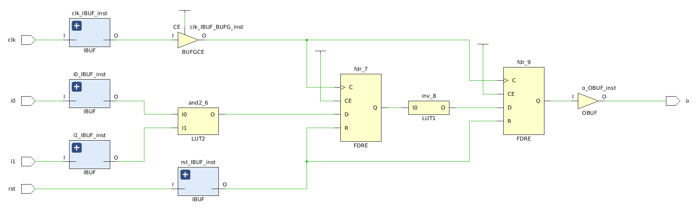
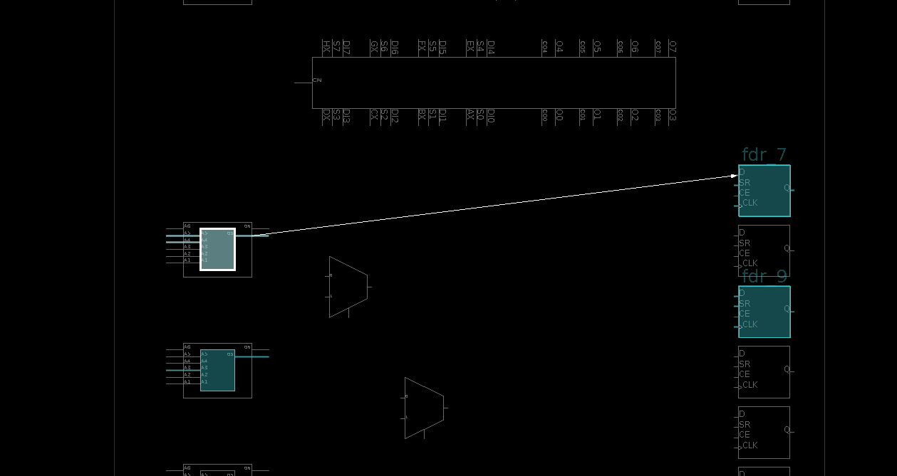

# Cava: Lava-style circuits in Coq

This is a work in progress attempt to encode Lava-style gate-level circuit descriptions
in Coq for circuit specification, formal verification and extraction into VHDL
or Verilog for implementation on FPGAs.

Cava provides a deep embedding for Lava-like circuits in Coq with
combinators to compose circuits. For example, a toy pipelined NAND gate
build from and AND gate and an inverter is described file the file
[Nand2.v](Nand2.v):

```Coq
Definition nand2_pipelined := Delay ∘ Inv ∘ Delay ∘ And2.
```
This describes a circuit which performs an AND of its two inputs,
then perform a one time unit delay, then performs an INV operation,
and finally performs another unit delay (reading the operations from
right to left).

This definition can be extracted from Coq into a Haskell program and
then linked with a Haskell module that converts this circuit
expression into a VHDL program. The automatically generated VHDL looks like:

```vhdl
library ieee;
use ieee.std_logic_1164.all;
package nand2_gate_package is
  component nand2_gate is
    port(
    signal clk : in std_ulogic;
    signal rst : in std_ulogic;
    signal i0 : in std_ulogic;
    signal i1 : in std_ulogic;
    signal o : out std_ulogic
  );
  end component nand2_gate;
end package nand2_gate_package;

library ieee;
use ieee.std_logic_1164.all;
entity nand2_gate is
  port(
    signal clk : in std_ulogic;
    signal rst : in std_ulogic;
    signal i0 : in std_ulogic;
    signal i1 : in std_ulogic;
    signal o : out std_ulogic
  );
end entity nand2_gate;

library unisim;
use unisim.vcomponents.all;
architecture cava of nand2_gate is
  signal net : std_logic_vector(0 to 9);
begin
  net(0) <= '0';
  net(1) <= '1';
  net(2) <= clk;
  net(3) <= rst;
  o <= net(9);
  fdr_9 : fdr port map (
    d => net(8),
    c => net(2),
    r => net(3),
    q => net(9)
  );
  inv_8 : inv port map (
    i => net(7),
    o => net(8)
  );
  fdr_7 : fdr port map (
    d => net(6),
    c => net(2),
    r => net(3),
    q => net(7)
  );
  and2_6 : and2 port map (
    i0 => net(4),
    i1 => net(5),
    o => net(6)
  );
  net(5) <= i1;
  net(4) <= i0;
end architecture cava ;

```

A testbench in the file [nand2_gate_tb.vhdl](nand2_gate_tb.vhdl) can be
used to simulate this circuit:


This can then be processed by the Xilinx tool to produce an implementation
on an FPGA. The implementation process produces the following mapping
onto the FPGA fabric:



This diagram shows how this circuit is mapped to a portion of an FPGA
with the two LUTs (lookup tables) on the left and the two registers
on the right:



This takes up a tiny part of a XCZU7EV-FFVC1156 FPGA (the small blue square
in the top right hand corner):

