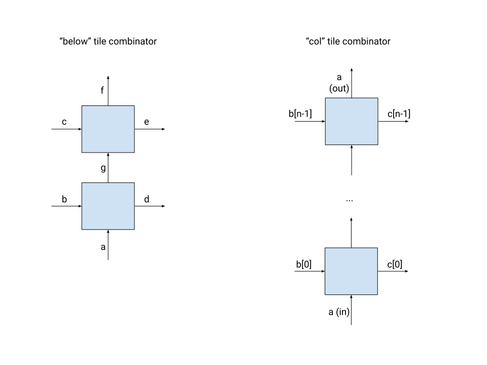
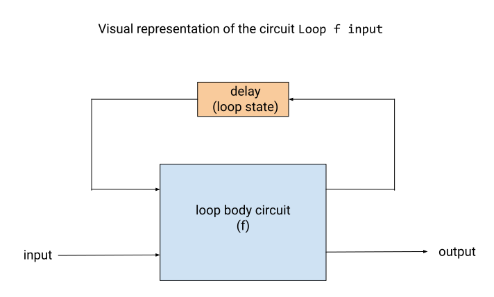

# Cava Reference

Details the main building blocks of circuits in Cava, for easy scanning and
searching. Everything detailed here is available with `Require Import Cava.Cava`
unless stated otherwise. For a more thorough introduction to Cava, check out the
[tutorial](demo/tutorial.html).

## Core Infrastructure

- `SignalType : Type` : Inductive structure representing the kinds of signals
  that Cava accepts (`Bit`, `Vec`, `Void`, `ExternalType`)
- `Cava : (SignalType -> Type), Type` : the core typeclass that provides
  primitive gates and a monad for building circuits. Circuit definitions are
  parameterized over a `Cava` instance, so that different instances can be
  plugged in for different purposes.
- `cava : Type -> Type` : an abstract monad used to preserve sharing, provided
  by the `Cava` typeclass. Combinational components of circuits in Cava are
  monadic functions using the `cava` monad.
- `Circuit : forall {i o : Type}, Type` : Inductive structure that represents a
  circuit with input type `i` and output type `o`. See the section on [circuit
  constructors](#circuit-constructors) for more details.

#### Simulation

- `simulate : forall {i o : Type}, Circuit i o -> list i -> list o` : Multi-step
  simulation function. Provided a circuit and a list of inputs, it produces a
  list of outputs.

#### Netlist Generation

- `CircuitInterface` : Record containing the interface for a circuit (e.g. input
  and output port names and types, name of clock signal) for netlist generation.
- `makeCircuitNetlist` : Generate a netlist from a `CircuitInterface` and a
  `Circuit`. Note that `tupleNetInterface`, which appears in the type
signature, converts a list of types to a flat tuple type.

## Circuit Subcomponents and Signals

### All Signal Types

- `eqb : forall {t : SignalType}, signal t * signal t -> cava (signal Bit)` :
  equality checker for any two signals of the same type.
- `defaultSignal : forall t : SignalType, signal t` : a dummy signal for any
  `SignalType`. This is especially useful for case statements that are not
  expected to be reached. Provided by the `Cava` typeclass.
- `mux2 : forall {A : SignalType}, signal Bit -> signal A * signal A -> cava
  (signal A)` : 2-element multiplexer
- `mux4 : forall {A : SignalType}, signal A * signal A * signal A * signal A ->
  signal (Vec Bit 2) -> cava (signal A)` : 4-element multiplexer

### Booleans

- `zero : signal Bit` : constant zero bit
- `one : signal Bit` : constant one bit
- `inv : signal Bit -> cava (signal Bit)` : boolean negation
- `and2 : signal Bit * signal Bit -> cava (signal Bit)` : boolean and
- `nand2 : signal Bit * signal Bit -> cava (signal Bit)` : not and
- `or2 : signal Bit * signal Bit -> cava (signal Bit)` : boolean or
- `nor2 : signal Bit * signal Bit -> cava (signal Bit)` : not or
- `xor2 : signal Bit * signal Bit -> cava (signal Bit)` : boolean xor
- `xnor2 : signal Bit * signal Bit -> cava (signal Bit)` : not xor
- `halfAdder : signal Bit * signal Bit -> cava (signal Bit * signal Bit)` : a
  half adder
- `fullAdder : signal Bit * (signal Bit * signal Bit) -> cava (signal Bit *
  signal Bit)` : a full adder

### Vectors

#### Constructing

- `Vec.nil : forall {A}, cava (signal (Vec A 0)) ` : an empty `Vec`
- `Vec.const : forall {A}, signal A -> forall (n : nat), cava (signal (Vec A
  n))` : create a `Vec` by repeating the same element `n` times
- `Vec.map_literal : forall {A B n}, (A -> cava (signal B)) -> Vector.t A n ->
  cava (signal (Vec B n))` : construct a `Vec` by mapping a monadic function
  over a Coq vector. This can be useful for permutations e.g `Vec.map_literal
  (indexConst v) indices` (construct a new `Vec` by indexing into `v` at the
  provided indices)

#### Adding and Removing Elements

- `Vec.cons : forall {A n}, signal A -> signal (Vec A n) -> cava (signal (Vec A
  (S n)))` : add an element to the head of a `Vec`
- `Vec.hd : forall {A n}, signal (Vec A (S n)) : cava (signal A)` : get the
  first element of a `Vec`
- `Vec.tl : forall {A n}, signal (Vec A (S n)) : cava (signal (Vec A n))` :
  remove the first element of a `Vec`
- `Vec.shiftin : forall {A n}, signal A -> signal (Vec A n) -> cava (signal (Vec
  A (S n)))` : add an element to the end of a `Vec`
- `Vec.last : forall {A n}, signal (Vec A (S n)) -> cava (signal A)` : get the
  last element of a `Vec`
- `Vec.shiftout : forall {A n}, signal (Vec A (S n)) -> cava (signal (Vec A
  n))` : remove the last element of a `Vec`

#### Resizing

- `Vec.resize_default : forall {A} m {n}, signal (Vec A n) -> cava (signal (Vec
  A m))` : coerce the size of a `Vec` to a different size; should only be used
  if the vector sizes are in fact equal (for instance, to coerce `n + n` to `n *
  2`). This helps defer the problem of proving the sizes are equal to proofs,
  and avoid introducing proof terms into the bodies of circuits.

#### Indexing

- `indexAt : forall (A : SignalType) (sz isz : nat), signal (Vec A sz) -> signal
  (Vec Bit isz) -> cava (signal A)` : dynamic indexing; index into one vector
  with another vector representing the index. The index is interpreted as
  little-endian.
- `indexConst : forall (t : SignalType) (sz : nat), signal (Vec t sz) -> nat ->
  cava (signal t)` : static indexing; index into a vector with a compile-time
  constant.

#### Rearranging Elements

- `Vec.rev : forall {A n}, signal (Vec A n) -> cava (signal (Vec A n))` :
  reverse the elements of a `Vec`
- `Vec.transpose : forall {A n m}, signal (Vec (Vec A n) m) -> cava (signal (Vec
  (Vec A m) n))` : matrix transposition
- `Vec.flatten : forall {A n m}, signal (Vec (Vec A m) n) -> cava (signal (Vec A
  (n * m)))` : create a one-dimensional vector by concatenating the inner vectors
- `Vec.reshape : forall {A n m}, signal (Vec A (n * m)) -> cava (signal (Vec
  (Vec A m) n))` : inverse of `flatten`

#### Convert to and from Vector.t

- `constantV : forall {A n}, Vector.t (signal A) n -> signal (Vec A n)` :
  Convert a compile-time constant vector to a signal. To prevent duplication of
  resources, use for literal constants only.

- `packV : forall {A n}, Vector.t (signal A) n -> cava (signal (Vec A n))` :
  convert a Coq `Vector.t` to a Cava `Vec`
- `Vec.packV2 : forall {A n0 n1}, Vector.t (Vector. (signal A) n0) n1 -> cava
  (signal (Vec (Vec A n0) n1))` : convert a two-dimensional Coq `Vector.t` to a
  two-dimensional Cava `Vec`
- `Vec.packV3` : convert a three-dimensional Coq `Vector.t` to a
  three-dimensional Cava `Vec`
- `Vec.packV4` : convert a four-dimensional Coq `Vector.t` to a four-dimensional
  Cava`Vec`

- `unpackV : forall {A n}, signal (Vec A n) -> cava (Vector.t (signal A) n)` :
  convert a Cava `Vec` to a Coq `Vector.t`
- `Vec.unpackV2 : forall {A n0 n1}, signal (Vec (Vec A n0) n1) -> cava (Vector.t
  (Vector.t (signal A) n0) n1)` : convert a two-dimensional Cava `Vec` to a
  two-dimensional Coq `Vector.t`
- `Vec.unpackV3` : convert a three-dimensional Cava `Vec` to a three-dimensional
  Coq `Vector.t`
- `Vec.unpackV4` : convert a four-dimensional Cava `Vec` to a four-dimensional
  Coq `Vector.t`

#### Higher-order functions

- `Vec.map : forall {A B n}, (signal A -> cava (signal B)) -> signal (Vec A n)
  -> cava (signal (Vec B n))` : apply a function to each element of the vector
- `Vec.map2 : forall {A B C n}, (signal A * signal B -> cava (signal C)) ->
  signal (Vec A n) * signal (Vec B n) -> cava (signal (Vec C n))` : apply a
  function with two inputs to each element of the two equal-length input vectors
- `Vec.fold_left : forall {A B}, (B * signal A -> cava B) -> forall {n}, signal
  (Vec A n) -> B -> cava B` : Perform a loop with the vector elements as inputs
  (here, `B` is the type of the loop state)
- `Vec.fold_left2 : forall {A B C} (f : C * signal A * signal B -> cava C) ->
  forall {n}, signal (Vec A n) * signal (Vec B n) -> C -> cava C` : Perform a
  2-input loop over two equal-length vectors (here, `C` is the type of the loop
  state)

#### Bit-Vectors

All bit vector arithmetic treats the bit vectors as unsigned and little-endian.

- `Vec.bitvec_literal : forall {n}, Vector.t bool n -> cava (signal (Vec Bit
  n))` : construct a bit-vector signal from a standard library vector.
- `all : forall {n}, signal (Vec Bit n) -> cava (signal Bit)` : returns true if
  every bit in the bit-vector is one, false otherwise.
- `any : forall {n}, signal (Vec Bit n) -> cava (signal Bit)` : returns true if
  any bit in the bit-vector is one, false otherwise.

- `Vec.inv : forall {n}, signal (Vec Bit n) -> : cava (signal (Vec Bit n))` :
  apply the boolean operation `inv` to all elements of the input vector.
- `Vec.and : forall {n}, signal (Vec Bit n) * signal (Vec Bit n) -> : cava
  (signal (Vec Bit n))` : apply the boolean operation `and2` to all elements of
  the input vector.
- `Vec.and : forall {n}, signal (Vec Bit n) * signal (Vec Bit n) -> : cava
  (signal (Vec Bit n))` : apply the boolean operation `and2` to all elements of
  the input vector.
- `Vec.nand : forall {n}, signal (Vec Bit n) * signal (Vec Bit n) -> : cava
  (signal (Vec Bit n))` : apply the boolean operation `nand2` to all elements of
  the input vector.
- `Vec.or : forall {n}, signal (Vec Bit n) * signal (Vec Bit n) -> : cava
  (signal (Vec Bit n))` : apply the boolean operation `or2` to all elements of
  the input vector.
- `Vec.nor : forall {n}, signal (Vec Bit n) * signal (Vec Bit n) -> : cava
  (signal (Vec Bit n))` : apply the boolean operation `nor2` to all elements of
  the input vector.
- `Vec.xor : forall {n}, signal (Vec Bit n) * signal (Vec Bit n) -> : cava
  (signal (Vec Bit n))` : apply the boolean operation `xor2` to all elements of
  the input vector.
- `Vec.xnor : forall {n}, signal (Vec Bit n) * signal (Vec Bit n) -> : cava
  (signal (Vec Bit n))` : apply the boolean operation `xnor2` to all elements of
  the input vector.

- `addC : forall {n}, signal (Vec Bit n) * signal (Vec Bit n) * signal Bit ->
  cava (signal (Vec Bit n) * signal Bit)` : Unsigned adder for n-bit vectors
  with no bit-growth and carry bits both in and out
- `addN : forall {n}, signal (Vec Bit n) * signal (Vec Bit n) -> cava (signal
  (Vec Bit n))`: Unsigned adder for n-bit vectors with bit-growth and carry
  bits neither in nor out
- `squareN : forall {n}, signal (Vec Bit n) -> cava (signal (Vec Bit n))` :
  square an unsigned bit vector, truncating to the input size
- `unsignedAdd : forall a b : nat, signal (Vec Bit a) * signal (Vec Bit b) ->
  cava (signal (Vec Bit (1 + Init.Nat.max a b)))` : Synthesizable adder with
  bit-growth
- `unsignedMult : forall a b : nat, signal (Vec Bit a) * signal (Vec Bit b) ->
  cava (signal (Vec Bit (a + b)))` : Synthesizable multiplier with growth
- `greaterThanOrEqual : forall a b : nat, signal (Vec Bit a) * signal (Vec Bit
  b) -> cava (signal Bit)` : Comparison of unsigned bit vectors

### Circuit Combinators

#### Tuple Manipulation

These are especially useful with monad [composition](#compose) (`_ >=> _`).

- `fork2 : forall {A}, signal A -> cava (signal A * signal A)` : replicate a
  signal (fork a wire in the circuit)
- `first : forall {A B C}, (A -> cava C) -> (A * B) -> cava (C * B)` : apply a
  function to the first element of a pair
- `second : forall {A B C}, (B -> cava C) -> (A * B) -> cava (A * C)` : apply a
  function to the first element of a pair
- `swap : forall {A B}, (A * B) -> cava (B * A)` : swap elements of a pair
- `dropr : forall {A B}, (A * B) -> cava A` : drop right element of a pair
- `dropl : forall {A B}, (A * B) -> cava B` : drop left element of a pair
- `pair_left : forall {A B C}, (A * (B * C)) -> cava (A * B * C)` : reassociate
  input tuple (the `*` operator is left-associative, so `(A * B * C)` means `((A *
  B) * C))`)
- `pair_right : forall {A B C}, (A * B * C) -> cava (A * (B * C))` : reassociate
  input tuple (the `*` operator is left-associative, so `(A * B * C)` means `((A *
  B) * C))`)

#### 4-sided Tile Combinators

- `below : forall {A B C D E F G}, (A * B -> cava (D * G)) -> (G * C -> cava
  (E * F)) -> (A * (B * C)) -> cava ((D * E) * F)` : given two two-input
  two-output circuits, feed one output of the first circuit into the second
  circuit
- `col : forall {A B C}, (A * B -> cava (signal C * A)) -> A -> forall {n :
  nat}, Vector.t B n -> cava (signal (Vec C n) * A)` : chain a two-input
  two-output circuit with itself

The diagrams below illustrate the `below` and `col` combinators visually.

{: width="800px"}

#### Tree Combinators

- `tree : forall {t}, (signal t * signal t -> cava (signal t)) -> forall {n},
  signal (Vec t n) -> cava (signal t)` : create a balanced binary tree from a
  two-input circuit

### Lookup Tables

- `lut1 : (bool -> bool) -> signal Bit -> cava (signal Bit)` : 1-bit lookup;
  given a "table" function that returns a boolean given one boolean, emulate the
  function as a circuit. This is essentially a lookup in a table containing two
  elements.
- `lut2 : (bool -> bool -> bool) -> signal Bit * signal Bit -> cava (signal
  Bit)` : 2-bit lookup; a lookup in a table with four elements.
- `lut3 : (bool -> bool -> bool -> bool) -> signal Bit * signal Bit * signal Bit
  -> cava (signal Bit)` : 3-bit lookup
- `lut4` : 4-bit lookup
- `lut5` : 5-bit lookup
- `lut6` : 6-bit lookup

### Netlist-specific

These operations affect the generated SystemVerilog but not generally the
functional behavior of the circuit, but can be used for fine-grained control
over resource usage.

- `buf_gate : signal Bit -> cava (signal Bit)` : generate a `buf` primitive in
  SystemVerilog
- `localSignal : forall t, signal t -> cava (signal t)` : ensures that the given
  signal has an explicit numbering in the netlist, rather than being an
  expression, which can help prevent duplicated logic
- `blackBox` : create a black box circuit with a given interface (for instance,
  for externally defined components)
- `instantiate` : create a module in `SystemVerilog` with the provided
  circuit. This produces a hierarchical design which may be useful for tooling
  that consumes the SystemVerilog.

## Circuit Constructors

These constructors are the building blocks for `Circuit`s.

Generally, we recommend writing the purely combinational components of circuits
using monadic functions, and then using these constructors to combine
non-combinational parts.

- `Comb : forall {i o : Type}, (i -> cava o) -> Circuit i o` : a purely
  combinational circuit, constructed from a monadic function
- `Compose : forall {i t o : Type}, Circuit i t -> Circuit t o -> Circuit i o` :
  compose two circuits in sequence by feeding the output of the first as the
  input of the second (usually represented by the `>==>` notation)
- `First : forall {i o t : Type}, Circuit i o -> Circuit (i * t) (o * t)` :
  combine a circuit with a wire to create a two-input two-output `Circuit` that
  leaves the second input untouched
- `Second : forall {i o t : Type}, Circuit i o -> Circuit (t * i) (t * o)` :
  combine a circuit with a wire to create a two-input two-output `Circuit` that
  leaves the first input untouched

- `Delay : forall {t : SignalType}, Circuit (signal t) (signal t)` : add a
  register with type `t`, which delays the data by one clock cycle. The initial
  state of the register is determined by `defaultSignal`.
- `DelayInit : forall {t : SignalType}, signal t -> Circuit (signal t) (signal
  t)` : Delay with an explicit (compile-time constant) initial state.
- `DelayCE : forall {t : SignalType}, Circuit (signal t * signal Bit) (signal
  t)` : Delay with a 1-bit clock enable input. If the enable bit is false, the
  state is frozen for that clock cycle.
- `DelayInitCE : forall {t : SignalType}, signal t -> Circuit (signal t * signal
  Bit) (signal t)` : the most general form of a delay, including both a clock
  enable input and an explicit initial state. All other delay constructors are
  defined in terms of this one.

- `Loop : forall {i o : Type} {s : SignalType}, Circuit (i * signal s) (o *
  signal s) -> Circuit i o` : create a feedback loop by composing a circuit with
  itself; connect the `s` output wire to a delay, and connect the other end of
  the delay to the `s` input wire. The initial state of this delay (and
  therefore, the first `s` input to the inner circuit) is determined by
  `defaultSignal`.
- `LoopInit : forall {i o : Type} {s : SignalType}, signal s -> Circuit (i *
  signal s) (o * signal s) -> Circuit i o` : Loop with an explicit (compile-time
  constant) initial state.
- `LoopCE : forall {i o : Type} {s : SignalType}, Circuit (i * signal s) (o *
  signal s) -> Circuit (i * signal Bit) o` : Loop with a 1-bit clock enable
  input. If the enable bit is false, the state is frozen for that clock cycle.
- `LoopInitCE : forall {i o : Type} {s : SignalType}, signal s -> Circuit (i *
  signal s) (o * signal s) -> Circuit (i * signal Bit) o` : the most general
  form of a loop, including both a clock enable input and an explicit initial
  state. All other loop constructors are defined in terms of this one.

{: width="700px"}

## Proof Automation

These tactics and rewrite databases will greatly simplify Cava proofs; they're
not mandatory, but it's a good idea to know that they exist and roughly what
they do. This list is not exhaustive.

For more detail on a particular tactic, try searching the codebase for
other places where it's used, or for the tactic's test cases.

## Tactics

`simpl_ident`: transforms an expression in terms of the identity monad (this
will be practically all circuit proofs) and/or circuit simulations into a
non-monadic expression, which will be easier to reason about.

`length_hammer` : solves most goals relating to list lengths (e.g. `length
(firstn n (a ++ b)) < 4`).

`destruct_pair_let` : Coq's `let '(x,y) := _ in` syntax is convenient but
doesn't simplify away easily in proofs. This tactic simplifies it for you, so
that an expression like `foo (let '(x,y,z) := p in z)` becomes `foo (snd p)`.

`logical_simplify` : performs a few commonly-needed simplifications to the
hypotheses in context. For instance, if you have `H : exists x, P x /\ exists
y, Q x y`, this tactic will give you a context with new variables for `x` and
`y`, and the two hypotheses `P x` and `Q x y`.

`constant_vector_simpl v`: if `v` is a constant-length vector in the current
context, destructs it into its elements (so instead of `Vector.t nat 4`, you
have 4 variables of type `nat`)

`constant_bitvec_cases v`: if `v` is a boolean vector of constant length in the
current context, creates a subgoal for each possible value of `v`. For
instance, if `v` has the type `Vector.t bool 3`, you will get 8 subgoals (one
for `v = [false;false;false]`, one for `v=[true;false;false]`, etc.). Useful
for situations in which you have a limited number of cases and want to prove
each one by computation.

## Autorewrite databases

Autorewrite databases in Coq (see the manual entries on
[autorewrite](https://coq.inria.fr/distrib/current/refman/proofs/automatic-tactics/auto.html?highlight=autorewrite#coq:tacn.autorewrite)
and [Hint
Rewrite](https://coq.inria.fr/distrib/current/refman/proofs/automatic-tactics/auto.html?highlight=autorewrite#coq:cmd.Hint-Rewrite)
are powerful and often underused tools for automatic reasoning in Coq. For
those new to the idea, it works like this:

```
Hint Rewrite @app_length using solve [eauto] : push_length.
Hint Rewrite @nil_length using solve [eauto] : push_length.
Hint Rewrite @repeat_length using solve [eauto] : push_length.

Goal (forall T (x : T) n m, length (repeat x n ++ [] ++ repeat x m) = n + mw).
intros.
(* Goal: length (repeat x n ++ [] ++ repeat x m) = n + m *)
autorewrite with push_length.
(* Goal : n + (0 + m) = n + m *)
Abort.
```

Basically, you can add a whole bunch of lemmas to the hint database, and then
use `autorewrite` to rewrite with them in whatever order works. The `solve
[eauto]` can be replaced with any tactic that you want to apply to the
rewrite's side conditions; for a lemma with an arithmetic side condition, you
might want `lia`. It's good practice to make sure that the tactic won't leave
unsolved goals (hence `solve [eauto]` even though none of the lemmas above
actually generate side conditions).

Cava defines a number of autorewrite databases that you can use and add to,
including the `push_length` one in the example.  Some of the tactics mentioned
above actually use autorewrite databases, too; if you add a lemma to the
`push_length` hint database, for instance, the `length_hammer` tactic will know
about your lemma and use it to solve list-length goals.

One final note: many autorewrite databases are named `push_foo`, for some
definition `foo`. This means that lemmas added to that database "push" the
`foo` definition further into the expression, or eliminate it. For instance, the lemma
`app_length`, which has the type `forall {A} (l l' : list A), length (l ++ l')
= length l + length l'`, has `length` as the outermost expression on the
left-hand side, but has `add` as the outermost expression on the right-hand
side, with `length` deeper in the expression tree. The lemma `nil_length`,
which has the type `length [] = 0`, removes a `length` invocation.

The most useful autorewrite databases defined by Cava are:

- `push_simulate` : simplifies expressions with the circuit simulation definition `simulate`
- `simpl_ident` : contains lemmas proving that circuits obey their
  specifications; used by the `simpl_ident` tactic
- `push_length` : simplifies expressions with list `length`
- `vsimpl` : general-purpose simplification of vector expressions
- `natsimpl` : general-purpose simplification of natural-number expressions

## Notations

### Monad Notations

In Cava circuits, combinational functions are written using an abstract monad
called `cava` to record sharing. As a result, there are a few monad notations
that are helpful to know:

- `ret` : [return](#return)
- `_ <- _ ;; _` : [basic bind](#basic-bind)
- `'(_, ... , _) <- _ ;; _` : [patterned bind](#patterned-bind)
- `_ >=> _` : [compose](#compose)
- ` _ >>= _` : [alternate bind](#alternate-bind)
- ` _ =<< _` : [alternate bind](#alternate-bind)

Each is discussed in more detail below.

#### Return

```coq
ret
```

Simply wraps any expression in a monad (return).

Examples: `ret 5`, `ret (x, y)`, `ret (foo (bar x, y))`

#### Basic Bind

```coq
_ <- _ ;; _
```
Assigns an expression to a name. `x <- foo ;; ... ` binds `foo` to the name `x`,
and the expression after the `;;` can use the name `x`. This operator is
right-associative: `x <- foo ;; y <- bar ;; ...` is interpreted as `x <- foo ;;
(y <- bar ;; (...))`.

You'll often see a newline after the `;;`, which is stylistically preferred but
not strictly necessary; whitespace, as for all Coq notations, is ignored.

##### Examples

Return the sum of two numbers:

```coq
sum <- addN (a, b) ;;
ret sum
```

Xor four bits (`a ^ b ^ c ^ d`):

```coq
ab <- xor2 (a, b) ;;
abc <- xor2 (ab, c) ;;
xor2 (abc, d)
```

#### Patterned Bind

```coq
'(_, ... , _) <- _ ;; _
```

Very similar to `_ <- _ ;; _`, except that this version names elements of pairs
individually. `'(x,y,z) <- foo ;; ...` is equivalent to `xyz <- foo ;; let
'(x,y,z) := xyz in ...`

You can write an underscore `_` to avoid naming an element of a pair that you do
not intend to use.

##### Examples

Add with carry, return carry and sum in reverse order:

```coq
'(sum, cout) <- addC (a, b, cin) ;;
ret (cout, sum)
```

Add with carry, but ignore the carry out and just return the sum:

```coq
'(sum, _) <- addC (a, b, cin) ;;
ret sum
```

#### Compose

```coq
_ >=> _
```

Compose two monadic functions. `(f >=> g) x` is equivalent to `y <- f x ;; g
y`. Not to be confused with the [analogous operation](#circuit-compose) for
sequential circuits, which has two equal signs, `_ >==> _`.

##### Examples

Get the third element of a `Vec` (`Vec.hd (Vec.tl (Vec.tl v))`):

```coq
(Vec.tl >=> Vec.tl >=> Vec.hd) v
```

Less-than-or-equal function for bits, in terms of less-than. An equivalent
function in plain Coq syntax would be `fun '(a, b) => inv (ltb (b, a))`.

```coq
swap >=> ltb >=> inv
```

#### Alternate Bind

```coq
x >>= f
```
OR
```coq
f >>= x
```

Both are equivalent to `y <- x ;; f y`. This binding notation is used less
frequently than the others, but still comes up occasionally.

##### Examples

Invert x twice (`inv (inv x)`):

```coq
inv x >>= inv
```

### Circuit Notations

Optional; import with `Import Circuit.Notations`.

#### Circuit Compose

```coq
_ >==> _
```

Notation for `Circuit.Compose`. Very similar to `_ >=> _`, except that it
composes `Circuit`s (which may have sequential components) instead of monadic
functions (guaranteed to be combinational). `Comb f >==> Comb g` (composition of
two purely combinational circuits) is equivalent to `Comb (f >=> g)`.

##### Examples

Duplicate a 1-bit signal, then invert one of the resulting wires (equivalent to
`fun i : signal Bit => '(i0, i1) <- fork2 i ;; not_i0 <- inv i0 ;; ret
(not_i0, i1)`):
```coq
Comb fork2 >==> First (Comb inv)
```

Duplicate a signal, and then add a delay to one of the resulting wires:
```coq
Comb fork2 >==> First Delay
```

Invert a bit vector signal and then feed the result to a counter:
```coq
Comb Vec.inv >==> Loop (Comb (addN >=> fork2))
```

### Bit-Vector Notations

Import with `Import Vec.BitVecNotations`.

#### And

```coq
_ & ... & _
```

`a & b & c & d` is equivalent to `Vec.and (Vec.and (Vec.and a b) c) d`

#### Or

```coq
_ | ... |  _
```

`a | b | c | d` is equivalent to `Vec.or (Vec.or (Vec.or a b) c) d`

#### Xor

```coq
_ ^ ... ^  _
```

`a ^ b ^ c ^ d` is equivalent to `Vec.xor (Vec.xor (Vec.xor a b) c) d`
