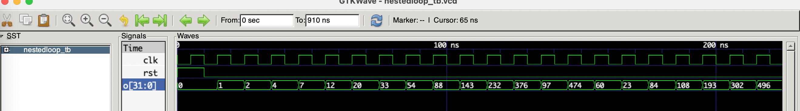

# A Loop Combinator for Cava

## Introduction
This directory contains an example of the "Cava API" that I would ideally like to use for describing circuits
with feedback and is an attempt to reproduce the `loop` combinator of Lava, as sketched elsewhere in this
repo in the [Lava](/../lava/Lava.hs) directory. Please read this Haskell file now to get some background
into how I wish we can write circuits with feedback.

Specifically, the Lava-style `loop` combinator takes a circuit which maps a pair of inputs to a pair of outputs.
The `loop` combinator "bends" the second output wire and connects it to the second input wire.
```
   ------------
  |    ----    |
  |-->|    |---  C (looped back)
      |    |
  A ->|    | -> B
       ----
```


First, let's distinguish between two things:
* Expressing state elements, i.e. using the `delay` circuit which just delays an input stream by one clock tick
  by adding a default value at the front of the list (stream). There is no issue doing this in Cava and that's
  exactly how the `delay` combinator is defined.
* Expressing a cycle in the circuit graph, i.e. a feedback loop, which ideally is a concept totally independent
  of whether there are any `delay` elements in the body of the loop. This is easily done in Haskell because of lazy
  evaluation and a recursive monadic-do notation which lets us tie the knot from an output of a circuit to an input
  to the same circuit. I don't know how to achieve this in Coq using lists.

As a workaround, we've explored various ways of using a `loopDelay` combinator i.e. a combinator that has a delay
element fused onto the feedback path of the loop combinator. If this can be made to work OK in Coq, then fine.
Ideally, I'd like to totally divorce the concepts of `delay` and `loop` (and then just reject loops that don't contain
at least one delay in some analysis phase). I'd also like `loop` combinators to contain circuits which are themselves
`loop` circuits. I think this is important because it lets me think in a modular way about sequential circuits and
it allows me to instantiate sub-bits of the state close to where they are used, rather than conceptually have all the state information
in one place along the loop wire. Another key aspect is that we want to be able to obtain the semantics of a circuit
by **directly evaluating the circuit** in simulation mode, with the circuit returning an **expression** which represents
the meaning of the circuit for the given inputs, rather than indirectly interpreting the circuit description somehow in some context.

Furthermore, I don't wish there to be any stratification between so-called "sequential" and "combinational" elements: circuits
are just circuits to me and they should all be composed uniformly e.g. any circuits `A` and `B` that are type-compatible should
be composble with the Kleisli arrow as `A >=> B` regardless of whether `A` or `B` contain `delay` elements or `loop`s.

So ideally I'd like to see an interface like this:
```coq
Inductive SignalType :=
  | Bit : SignalType 
  | Nat : SignalType.

Class Acorn acorn `{Monad acorn} (signal : SignalType -> Type) := {
  (* An invertor gate. *)
  inv : signal Bit -> acorn (signal Bit); 
  (* A NAND gate *)
  and2 : signal Bit * signal Bit -> acorn (signal Bit); 
  (* Add two nat values and then mod by a nat *)
  addMod : nat -> signal Nat * signal Nat -> acorn (signal Nat);
  (* Delay a wire of nat values by one clock cycle. *)
  natDelay : signal Nat -> acorn (signal Nat);
  (* Lava type loop combinator for feedback *)
  loop : (signal Nat * signal Nat -> acorn (signal Nat * signal Nat)) -> 
         signal Nat -> acorn (signal Nat);
  (* Ideally an infinite source of some nat value *)
  constNat : nat -> acorn (signal Nat);
  (* True if the first value is > to the second value. *)
  comparator : signal Nat * signal Nat -> acorn (signal Bit); 
  (* If bool select signal is true then mux2 the first value in the pair, otherwise second element is returned *)
  mux2 : signal Bit * (signal Nat * signal Nat) -> acorn (signal Nat); 
}.
```
Here is an example of a circuit that contains two nested loops:
```coq
Definition nestedloop : state Netlist unit :=
  one <- constNat 1 ;;
  o <- loop (snD natDelay >=> addMod 512 >=> loop (addMod 512 >=> natDelay >=> fork2) >=> fork2) one ;;
  outputNat o "o".
```
We can generate a netlist for this circuit without any issues:
```verilog
module nestedloop (input logic clk, input logic rst, output int unsigned o);
timeunit 1ns; timeprecision 1ns;
  int unsigned nat0;
  int unsigned nat1;
  int unsigned nat2;
  int unsigned nat3;
  int unsigned nat4;
  int unsigned nat5;
  int unsigned nat6;
  assign o = nat6;
  assign nat1 = nat6;
  assign nat4 = nat6;
  always_ff @(posedge clk) nat6 <= rst ? 0 : nat5;
  assign nat5 = (nat3 + nat4) % 512;
  assign nat3 = (nat0 + nat2) % 512;
  always_ff @(posedge clk) nat2 <= rst ? 0 : nat1;
  assign nat0 = 1;
endmodule
```
And when we simulate it we observe it does the right thing:


However, given the API above, I don't know how to simulate this circuit i.e. attribute a semantics to it.
In Haskell we don't have this problem because we can write a general loop combinator for monadic definitions:
```haskell
loop :: MonadFix m => ((a, c) -> m (b, c)) -> a -> m b
loop circuit a
  = do rec (b, c) <- circuit (a, c)
       return b
```
Notice that `c` occurs on the LHS and RHS of the binding. I don't know how to achieve this in Coq. The Haskell
version works because of lazy evaluation, the wires that are threaded through the nested loops are evaaluated in
a demand driven manner and in principle the nested loop expression is only "run once" and its sub-components
are evaluated as if they were co-routines as we tug on the output. The "run only once" aspect is emphasized
in the definition of `MonadFix`:
```haskell
class (Monad m) => MonadFix m where
        -- | The fixed point of a monadic computation.
        -- @'mfix' f@ executes the action @f@ only once, with the eventual
        -- output fed back as the input.  Hence @f@ should not be strict,
        -- for then @'mfix' f@ would diverge.
        mfix :: (a -> m a) -> m a
```

What is the best way of implementing a `loop` or `loopDelay` combinator in Coq for which we can attribute
simulation semantics which deal with feedback loops? Does this require us to use Coq's `stream` type
and use co-induction? Or can we achieve the same effect as the Haskell version in some other way?
