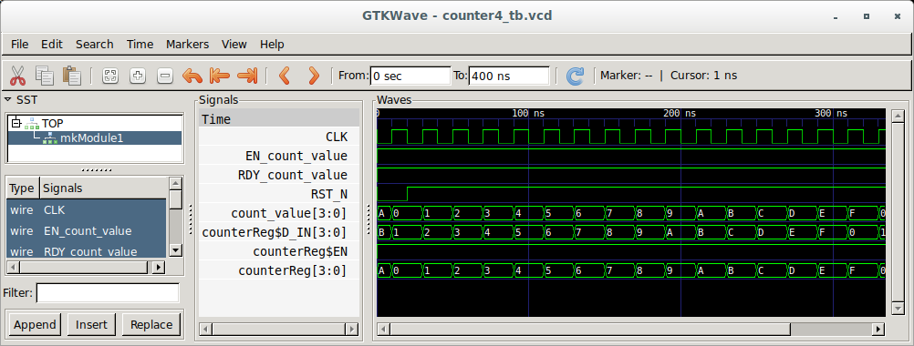
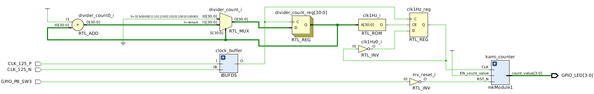
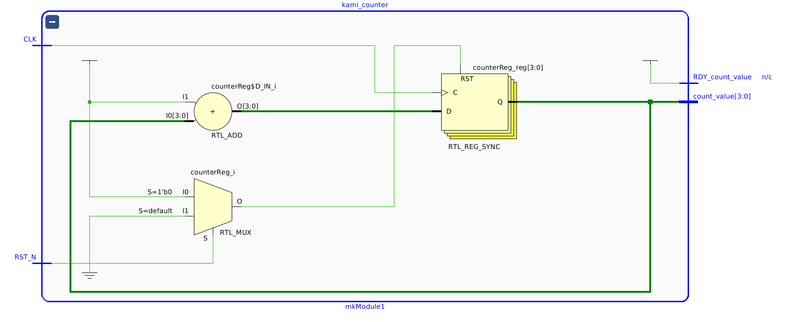
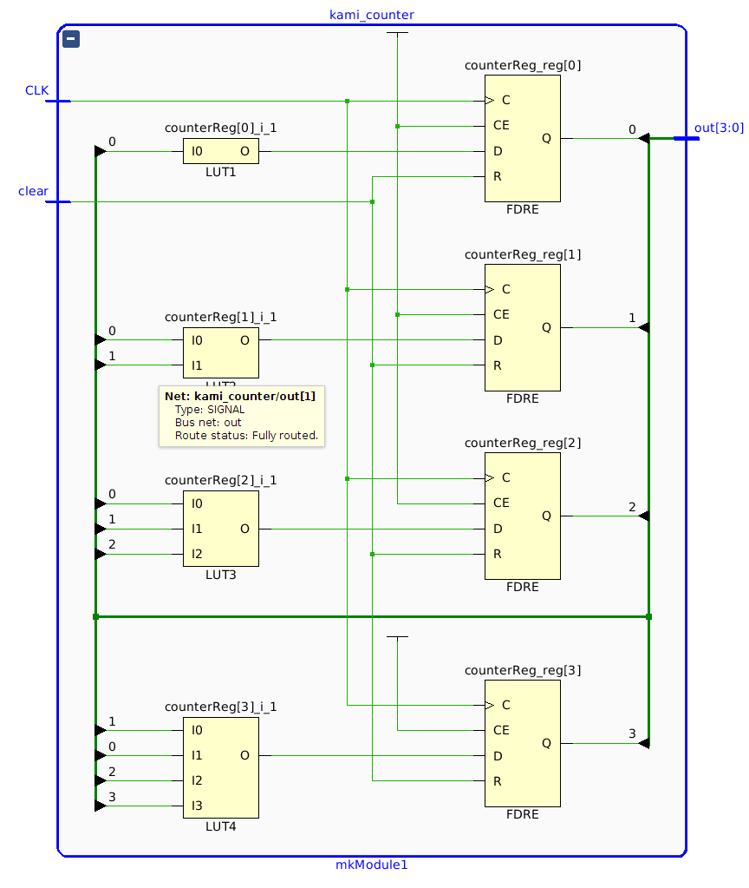
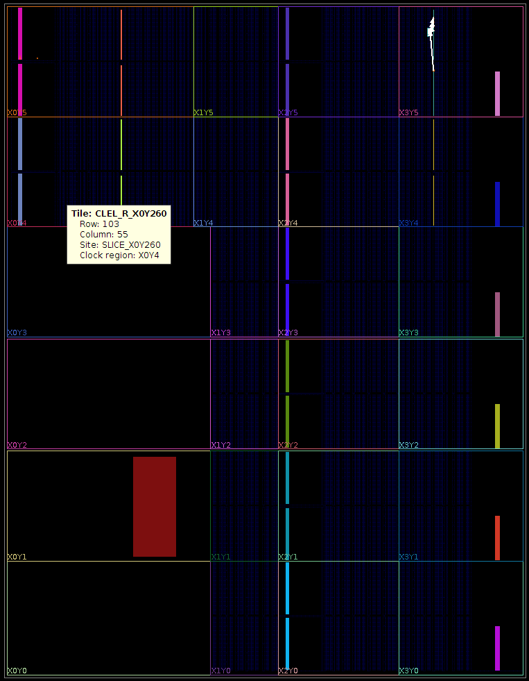
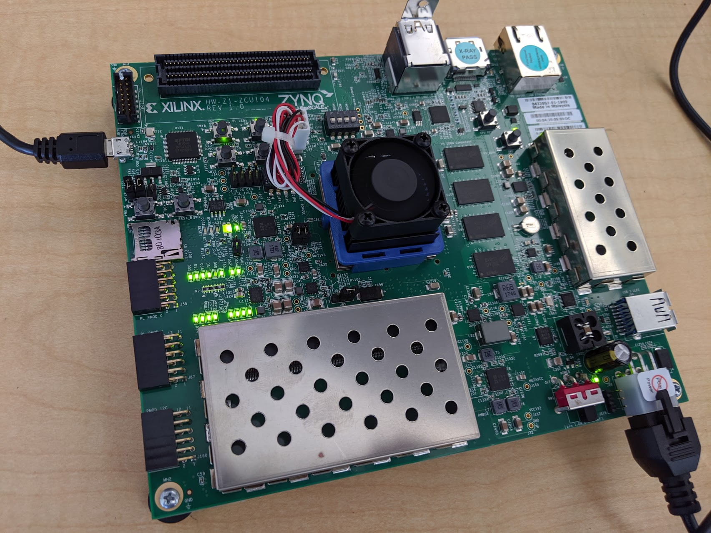

# Kami 4-bit Counter Experiment

This directory contains an example that uses th [Kami](https://github.com/mit-plv/kami) system to specify a simple counter circuit and drive it through the point where we can generate a Verilog netlist which can be implemented and the Xilinx [ZCU104](https://www.xilinx.com/products/boards-and-kits/zcu104.htm) FPGA development board and run. The counter controls four LEDs on the board which are made
to flash in the binary sequence 0..7 and a push-button switch on the board is used to reset the counter back to 0. The entire flow from circuit extraction from Coq to FPGA bitstream generation can be run by
just typing `make` in this directory. Typing `make configure` will actually configure a connected
ZCU104 FPGA board and start to make the LEDs flash in the 0..7 sequence.

The example we start with is a simple 4-bit counter [Counter.v](Counter.v):
```coq
Require Import Kami.
Require Import Kami.Syntax.
Require Import Kami.Synthesize.
Require Import Ext.BSyntax.
Require Import ExtrOcamlNatInt ExtrOcamlString.

Definition count := MethodSig ("counter" -- "count_value") (Bit 4) : Void.

Definition counter4 := MODULE {
    Register "counterReg" : Bit 4 <- $0

    with Rule "incrementAndOutput" :=
       Read val <- "counterReg";
       Write "counterReg" <- #val + ($1 :: Bit 4);
       Retv

    with Method "count_value" () : (Bit 4) :=
       Read counterValue <- "counterReg";
       Ret #counterValue

  }.

Hint Unfold count : MethDefs.
Hint Unfold counter4 : ModuleDefs.

Extraction Language Ocaml.

Set Extraction Optimize.
Set Extraction KeepSingleton.
Unset Extraction AutoInline.

Definition targetCounter4 := ModulesSToBModules (getModuleS counter4).

Extraction "Counter.ml" targetCounter4.
```

The Coq code here describes a simple 4-bit counter circuit which increments the counter every clock cycle.
When the circuit is reset the counter is initialized with the value 0. This Coq description is cast in terms
of a DSL based on the Bluespec language. We could have written the counter in Bluespec as:

```
interface Counter;
  method Bit#(4) count();
endinterface

(* synthesize *)
module mkCounter4(Counter);
   Reg#(Bit#(4)) value <- mkReg(0);

   rule counter;
     value <= value + 1;
   endrule

   method int count();
    return value;
   endmethod

endmodule: mkCounter4
```
The Kami code shown above is a representation of this Bluespec in Coq with a DSL.

When the Kami code for the counter is evaluated an OCaml program `Counter4.ml` is extracted from Coq.
This program is linked with a suitable pretty-printing module for Bluespec code
generation and when executed generates the corresponding Bluespec module `Counter4.bsv`:

```
import Vector::*;
import BuildVector::*;
import RegFile::*;
import RegFileZero::*;
import MulDiv::*;

interface Module1; method ActionValue#(Bit#(4)) count_value ();
endinterface

module mkModule1 (Module1);
    Reg#(Bit#(4)) counterReg <- mkReg(4'h0);
    
    rule incrementAndOutput;
        let x_0 = (counterReg);
        counterReg <= (x_0) + ((Bit#(4))'(4'h1));
        
    endrule
    
    
    method ActionValue#(Bit#(4)) count_value ();
        let x_1 = (counterReg);
        return x_1;
    endmethod
    
endmodule

module mkTop (Empty);Module1 m1 <- mkModule1 ();
                     
endmodule

```

A Bluespec compiler can be used to synthesize this Bluespec description into a Verilog implementation.
The generated Verilog file (`mkModule1.v`) contains a circuit module with the following interface ports:

```verilog
// Ports:
// Name                         I/O  size props
// count_value                    O     4 reg
// RDY_count_value                O     1 const
// CLK                            I     1 clock
// RST_N                          I     1 reset
// EN_count_value                 I     1 unused
//
// No combinational paths from inputs to outputs
module mkModule1(CLK,
                 RST_N,
                 EN_count_value,
                 count_value,
                 RDY_count_value);
  input  CLK;
  input  RST_N;

  // actionvalue method count_value
  input  EN_count_value;
  output [3 : 0] count_value;
  output RDY_count_value;

```

We can create a top level simulation test bench [counter4_tb.cpp](counter4_tb.cpp) for use with the
open source [Verilator](https://www.veripool.org/wiki/verilator) Verilog simulator and simulate the generated Verilog to make sure it does actually behave like a counter. Running the simulation produces a waveform
trace file `counter4_tb.vcd` which we can view with a VCD waveform visulaization program like
[GTKWave](http://gtkwave.sourceforge.net/):



The simulation shows the counter correctly being initialized to 0 when the active low reset is applied, and
then counting up by 1 every clock cycle afterwards and the active low reset is de-asserted.

We can use this counter to control the flashing of the LEDs on the ZCU104 development board. We need to
produce a top-level circuit that wires up the pins for the LEDs and the reset button to the core counter
circuit generated from Kami. So we can see the LEDs flash at a frequency suitable for human consumption
we take one of the clock inputs to the FPGA (a 125MHz differential pair) and divide it down to 1Hz to
control the sequencing of the LED flashes. The code for this top level circuit is in the VHDL file
[counter4_top.vhdl](counter4_top.vhdl) which instantiates the generated `mkModule1` module and wires
it up appropriately. Along with a file that specifies the location of the pins to be used on FPGA chip
[counter4.xdc]9counter4.xdc) we can use the Xilinx tools to convert this source (partly generated from
Kami/Coq and partly written by us) into a programming bitstream for the FPGA board.

The Xilinx synthesis tools generate this schemantic for the top-level block which instantiates
the Kami counter with the slowed-down clock and the wiring for the LEDs and reset:



Drilling down in the Kami counter block in this schematic we can see the hardware that was elaborated
from the description that started off in Kami/Coq:



The Xilinx design tools synthesize this elaborated design into a netlist which at the level of
the gates available of the specific Xilinx Zync UltraScale+ FPGA that we are mapping to:



The counter circuit is implemented in the top right hand corner of the Xilinx XCZU7ev-ffvc1156-2-e FPGA:



When the  ZCU104 FPGA board is programmed the LEDs can be observed flashing in the correct
sequence in the top left hand part of the board.


