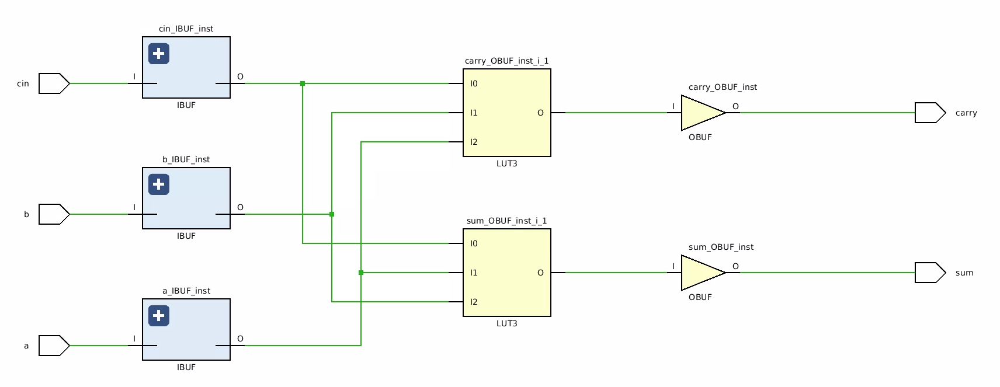

# The Nand Game gates in Cava

This directory contains a Coq file [NandGame.v](https://github.com/project-oak/oak-hardware/blob/master/nandgame/NandGame.v)
which implements some of the gates described at the [Nand Game](http://nandgame.com/) web page
which gets users to build circuit blocks using only NAND gates. The
implementation and proofs are done using the [Cava](https://github.com/project-oak/oak-hardware/tree/master/cava) system which needs
to be installed before the circuits and proofs can be generated in this directory.

To generate SystemVerilog for some of the circuits described in [NandGame.v](https://github.com/project-oak/oak-hardware/blob/master/nandgame/NandGame.v) and also run the proofs just type `make`:

```bash
$ make
```

## Inverter
An inverter is described as follows using only NAND gates, and we also
give the proof that the inverter actually inverts the input.

```coq
Definition inverter {m t} `{Cava m t} a := nand_gate [a; a].

Definition inverterTop {m t} `{CavaTop m t} :=
  setModuleName "invertor" ;;
  a <- input "a" ;
  b <- inverter a ;
  output "b" b.

Definition inverterNetlist := makeNetlist inverterTop.

(* A proof that the NAND-gate based implementation of the inverter is correct. *)
Lemma inverter_behaviour : forall (a : bool),
                           combinational (inverter a) = negb a.
Proof.
  intros.
  unfold combinational.
  unfold fst.
  simpl.
  rewrite andb_diag.
  reflexivity.
Qed.

```

This generates the following SystemVerilog code:

```verilog
module invertor(
  input logic a,
  output logic b
  );

  logic[0:1] net;

  // Wire up inputs.
  assign net[0] = a;
  // Wire up outputs.
  assign b = net[1] ;

  nand inst1 (net[1],net[0],net[0]);

endmodule
```

## And gate
Likewise, an AND gate built from NAND gates, along with a proof
about correct operation.

```coq
Definition andgate {m t} `{Cava m t}  a b :=
  x <- nand_gate [a; b] ;
  c <- inverter x ;
  return_ c.

Definition andgateTop {m t} `{CavaTop m t} :=
  setModuleName "andgate" ;;
  a <- input "a" ;
  b <- input "b" ;
  c <- andgate a b ;
  output "c" c.

Definition andgateNetlist := makeNetlist andgateTop.

(* A proof that the NAND-gate based implementation of the AND-gate is correct. *)
Lemma andgate_behaviour : forall (a : bool) (b : bool),
                          combinational (andgate a b) = a && b.
Proof.
  intros.
  unfold combinational.
  unfold fst.
  simpl.
  rewrite andb_diag.
  rewrite negb_involutive.
  reflexivity.
Qed.
```

This generates the following SystemVerilog code.

```verilog
module andgate(
  input logic b,
  input logic a,
  output logic c
  );

  logic[0:3] net;

  // Wire up inputs.
  assign net[1] = b;
  assign net[0] = a;
  // Wire up outputs.
  assign c = net[3] ;

  nand inst3 (net[3],net[2],net[2]);
  nand inst2 (net[2],net[0],net[1]);

endmodule
```

## Or gate
An OR gate and associated proof.

```coq
Definition orgate {m t} `{Cava m t} a b :=
  nota <- inverter a;
  notb <- inverter b;
  c <- nand_gate [nota; notb];
  return_ c.

Definition orgateTop {m t} `{CavaTop m t} :=
  setModuleName "orgate" ;;
  a <- input "a" ;
  b <- input "b" ;
  c <- orgate a b ;
  output "c" c.

Definition orgateNetlist := makeNetlist orgateTop.

(* A proof that the NAND-gate based implementation of the AND-gate is correct. *)
Lemma orgate_behaviour : forall (a : bool) (b : bool),
                         combinational (orgate a b) = a || b.
Proof.
  intros.
  unfold combinational.
  unfold fst. 
  simpl.
  rewrite andb_diag.
  rewrite andb_diag.
  rewrite negb_andb.
  rewrite negb_involutive.
  rewrite negb_involutive.
  reflexivity.
Qed.
```

This generates the following SystemVerilog code:

```verilog
module orgate(
  input logic b,
  input logic a,
  output logic c
  );

  logic[0:4] net;

  // Wire up inputs.
  assign net[1] = b;
  assign net[0] = a;
  // Wire up outputs.
  assign c = net[4] ;

  nand inst4 (net[4],net[2],net[3]);
  nand inst3 (net[3],net[1],net[1]);
  nand inst2 (net[2],net[0],net[0]);

endmodule
```

## Xor gate
And XOR-gate and proof of correct implementation:

```coq
Definition xorgate {m t} `{Cava m t} a b :=
  nab <- nand_gate [a; b] ;
  x <- nand_gate [a; nab] ;
  y <- nand_gate [nab; b] ;
  c <- nand_gate [x; y] ;
  return_ c.

Definition xorgateTop {m t} `{CavaTop m t} :=
  setModuleName "xorgate" ;;
  a <- input "a" ;
  b <- input "b" ;
  c <- xorgate a b ;
  output "c" c.
Definition xorgateNetlist := makeNetlist xorgateTop.


(* A proof that the NAND-gate based implementation of the XOR-gate is correct. *)
Lemma xorgate_behaviour : forall (a : bool) (b : bool),
                          combinational (xorgate a b) = xorb a b.
Proof.
  intros.
  unfold combinational.
  unfold fst. 
  simpl.
  case a, b.
  all : reflexivity.
Qed.
```

The generated SystemVerilog code:

```verilog
module xorgate(
  input logic b,
  input logic a,
  output logic c
  );

  logic[0:5] net;

  // Wire up inputs.
  assign net[1] = b;
  assign net[0] = a;
  // Wire up outputs.
  assign c = net[5] ;

  nand inst5 (net[5],net[3],net[4]);
  nand inst4 (net[4],net[2],net[1]);
  nand inst3 (net[3],net[0],net[2]);
  nand inst2 (net[2],net[0],net[1]);

endmodule
```

## Half-adder
A half-adder and proof of correct operation.

```coq
Definition halfAdder {m t} `{Cava m t} a b :=
  partial_sum <- xorgate a b ;
  carry <- andgate a b ;
  return_ (partial_sum, carry).

Definition halfAdderTop {m t} `{CavaTop m t} :=
  setModuleName "halfadder" ;;
  a <- input "a" ;
  b <- input "b" ;
  ps_c <- halfAdder a b ;
  output "partial_sum" (fst ps_c) ;;
  output "carry" (snd ps_c).

Definition halfAdderNetlist := makeNetlist halfAdderTop.

(* A proof that the NAND-gate based implementation of the half-adder is correct. *)
Lemma halfAdder_behaviour : forall (a : bool) (b : bool),
                            combinational (halfAdder a b) = (xorb a b, a && b).

Proof.
  intros.
  unfold combinational.
  unfold fst.
  simpl.
  case a, b.
  all : reflexivity.
Qed.
```

The generated SystemVerilog code:

```verilog
module halfadder(
  input logic b,
  input logic a,
  output logic carry,
  output logic partial_sum
  );

  logic[0:7] net;

  // Wire up inputs.
  assign net[1] = b;
  assign net[0] = a;
  // Wire up outputs.
  assign carry = net[7] ;
  assign partial_sum = net[5] ;

  nand inst7 (net[7],net[6],net[6]);
  nand inst6 (net[6],net[0],net[1]);
  nand inst5 (net[5],net[3],net[4]);
  nand inst4 (net[4],net[2],net[1]);
  nand inst3 (net[3],net[0],net[2]);
  nand inst2 (net[2],net[0],net[1]);

endmodule
```

## Full Adder
A full adder and its proof.

```coq
Definition fullAdder {m t} `{Cava m t} a b cin :=
  abl_abh <- halfAdder a b ;
  abcl_abch <- halfAdder (fst abl_abh) cin ;
  cout <- orgate (snd abl_abh) (snd abcl_abch) ;
  return_ (fst abcl_abch, cout).

Definition fullAdderTop {m t} `{CavaTop m t} :=
  setModuleName "fulladder" ;;
  a <- input "a" ;
  b <- input "b" ;
  cin <- input "cin" ;
  sum_cout <- fullAdder a b cin ;
  output "sum" (fst sum_cout) ;;
  output "carry" (snd sum_cout).


Definition fullAdderNetlist := makeNetlist fullAdderTop.

(* A proof that the NAND-gate based implementation of the full-adder is correct. *)
Lemma fullAdder_behaviour : forall (a : bool) (b : bool) (cin : bool),
                            combinational (fullAdder a b cin)
                              = (xorb cin (xorb a b),
                                 (a && b) || (b && cin) || (a && cin)).
Proof.
  intros.
  unfold combinational.
  unfold fst.
  simpl.
  case a, b, cin.
  all : reflexivity.
Qed.
```

The generated SystemVerilog code:

```verilog
module fulladder(
  input logic cin,
  input logic b,
  input logic a,
  output logic carry,
  output logic sum
  );

  logic[0:17] net;

  // Wire up inputs.
  assign net[2] = cin;
  assign net[1] = b;
  assign net[0] = a;
  // Wire up outputs.
  assign carry = net[17] ;
  assign sum = net[12] ;

  nand inst17 (net[17],net[15],net[16]);
  nand inst16 (net[16],net[14],net[14]);
  nand inst15 (net[15],net[8],net[8]);
  nand inst14 (net[14],net[13],net[13]);
  nand inst13 (net[13],net[6],net[2]);
  nand inst12 (net[12],net[10],net[11]);
  nand inst11 (net[11],net[9],net[2]);
  nand inst10 (net[10],net[6],net[9]);
  nand inst9 (net[9],net[6],net[2]);
  nand inst8 (net[8],net[7],net[7]);
  nand inst7 (net[7],net[0],net[1]);
  nand inst6 (net[6],net[4],net[5]);
  nand inst5 (net[5],net[3],net[1]);
  nand inst4 (net[4],net[0],net[3]);
  nand inst3 (net[3],net[0],net[1]);

endmodule
```

When this full adder netlist is synthesized and implemented by the
Xilinx Vivado tools it produces the following implementation:



Note that the design is not mapped to the fast carry logic by the
Xilinx synthesis tools, which are not able to process this NAND based
design to discover a mapping to a CARRY8 block or in terms of XORCY and
MUXCY components. Although this full adder will produce the correct
result, it will not be an efficient implementation. To see how
an efficient implementation can be produces, please seee the
page [Cava Examples](https://github.com/project-oak/oak-hardware/tree/master/cava-examples/README.md).