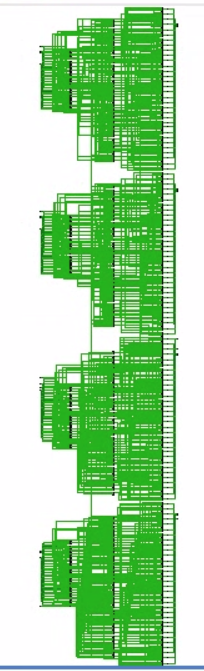

# AES Silver Oak Implementation

## Baseline OpenTitan version for comparison
We must use the snapshot of the OpenTitan source from 11 May 2020 as the baseline reference implementation
at commit hash [783edaf444](https://github.com/lowRISC/opentitan/tree/783edaf444eb0d9eaf9df71c785089bffcda574e) on the OpenTitan GitHub repo. For consistency and to allow us to produce a single FPGA implementation we should design and verify all our Silver Oak OpenTitan
components against this OpenTitan commit hash.

## Baseline OpenTitan SystemVerilog Components
* [aes_mix_columns.sv](https://github.com/lowRISC/opentitan/blob/783edaf444eb0d9eaf9df71c785089bffcda574e/hw/ip/aes/rtl/aes_mix_columns.sv)
* [aes_shift_rows.sv](https://github.com/lowRISC/opentitan/blob/783edaf444eb0d9eaf9df71c785089bffcda574e/hw/ip/aes/rtl/aes_shift_rows.sv)
* [aes_sbox.sv](https://github.com/lowRISC/opentitan/blob/783edaf444eb0d9eaf9df71c785089bffcda574e/hw/ip/aes/rtl/aes_sbox.sv)

## Mix Columns Performance Comparison
### OpenTitan `aes_mix_columns` baseline block
We have synthesized and implemented the OpenTitan `aes_mix_columns` in isolation to produce the following utilization report from Vivado. The synthesis report shows the design uses 259 LUTs.
```
-----------------------------------------------------------------------------------
| Tool Version : Vivado v.2018.3 (lin64) Build 2405991 Thu Dec  6 23:36:41 MST 2018
| Date         : Fri Jan 29 00:20:16 2021
| Host         : glasgow.mtv.corp.google.com running 64-bit Debian GNU/Linux rodete
| Command      : report_utilization -file aes_mix_columns_utilization_synth.rpt -pb aes_mix_columns_utilization_synth.pb
| Design       : aes_mix_columns
| Device       : 7a200tsbg484-1
| Design State : Synthesized
-----------------------------------------------------------------------------------

+-------------------------+------+-------+-----------+-------+
|        Site Type        | Used | Fixed | Available | Util% |
+-------------------------+------+-------+-----------+-------+
| Slice LUTs*             |  259 |     0 |    134600 |  0.19 |
|   LUT as Logic          |  259 |     0 |    134600 |  0.19 |
```

After implementation the utilization is reduced to 253 LUTs:

```
+-------------------------+------+-------+-----------+-------+
|        Site Type        | Used | Fixed | Available | Util% |
+-------------------------+------+-------+-----------+-------+
| Slice LUTs              |  253 |     0 |    133800 |  0.19 |
|   LUT as Logic          |  253 |     0 |    133800 |  0.19 |

+------------------------------------------+------+-------+-----------+-------+
|                 Site Type                | Used | Fixed | Available | Util% |
+------------------------------------------+------+-------+-----------+-------+
| Slice                                    |   75 |     0 |     33450 |  0.22 |
|   SLICEL                                 |   55 |     0 |           |       |
|   SLICEM                                 |   20 |     0 |           |       |
| LUT as Logic                             |  253 |     0 |    133800 |  0.19 |
|   using O5 output only                   |    0 |       |           |       |
|   using O6 output only                   |  190 |       |           |       |
|   using O5 and O6                        |   63 |       |           |       |
| LUT as Memory                            |    0 |     0 |     46200 |  0.00 |
|   LUT as Distributed RAM                 |    0 |     0 |           |       |
|   LUT as Shift Register                  |    0 |     0 |           |       |
| Slice Registers                          |    0 |     0 |    267600 |  0.00 |
|   Register driven from within the Slice  |    0 |       |           |       |
|   Register driven from outside the Slice |    0 |       |           |       |
| Unique Control Sets                      |    0 |       |     33450 |  0.00 |
+------------------------------------------+------+-------+-----------+-------+

```

### Silver Oak `aes_mix_columns` block
After synthesis the Silver Oak AES block turns out to use 184 LUTs.
```
-----------------------------------------------------------------------------------
| Tool Version : Vivado v.2018.3 (lin64) Build 2405991 Thu Dec  6 23:36:41 MST 2018
| Date         : Fri Jan 29 00:47:37 2021
| Host         : glasgow.mtv.corp.google.com running 64-bit Debian GNU/Linux rodete
| Command      : report_utilization -file aes_mix_columns_utilization_synth.rpt -pb aes_mix_columns_utilization_synth.pb
| Design       : aes_mix_columns
| Device       : 7a200tsbg484-1
| Design State : Synthesized
-----------------------------------------------------------------------------------


+-------------------------+------+-------+-----------+-------+
|        Site Type        | Used | Fixed | Available | Util% |
+-------------------------+------+-------+-----------+-------+
| Slice LUTs*             |  184 |     0 |    134600 |  0.14 |
|   LUT as Logic          |  184 |     0 |    134600 |  0.14 |
|   LUT as Memory         |    0 |     0 |     46200 |  0.00 |

```
After implementation:
```
+-------------------------+------+-------+-----------+-------+
|        Site Type        | Used | Fixed | Available | Util% |
+-------------------------+------+-------+-----------+-------+
| Slice LUTs*             |  184 |     0 |    134600 |  0.14 |
|   LUT as Logic          |  184 |     0 |    134600 |  0.14 |


+------------------------------------------+------+-------+-----------+-------+
|                 Site Type                | Used | Fixed | Available | Util% |
+------------------------------------------+------+-------+-----------+-------+
| Slice                                    |   54 |     0 |     33450 |  0.16 |
|   SLICEL                                 |   42 |     0 |           |       |
|   SLICEM                                 |   12 |     0 |           |       |
| LUT as Logic                             |  180 |     0 |    133800 |  0.13 |
|   using O5 output only                   |    0 |       |           |       |
|   using O6 output only                   |  152 |       |           |       |
|   using O5 and O6                        |   28 |       |           |       |
| LUT as Memory                            |    0 |     0 |     46200 |  0.00 |
|   LUT as Distributed RAM                 |    0 |     0 |           |       |
|   LUT as Shift Register                  |    0 |     0 |           |       |
| Slice Registers                          |    0 |     0 |    267600 |  0.00 |
|   Register driven from within the Slice  |    0 |       |           |       |
|   Register driven from outside the Slice |    0 |       |           |       |
| Unique Control Sets                      |    0 |       |     33450 |  0.00 |
+------------------------------------------+------+-------+-----------+-------+

```

A picture of the `aes_mix_columns` schematic in Vivado:



We should investigate why the Cava version is so much smaller since this sounds very suspicious.